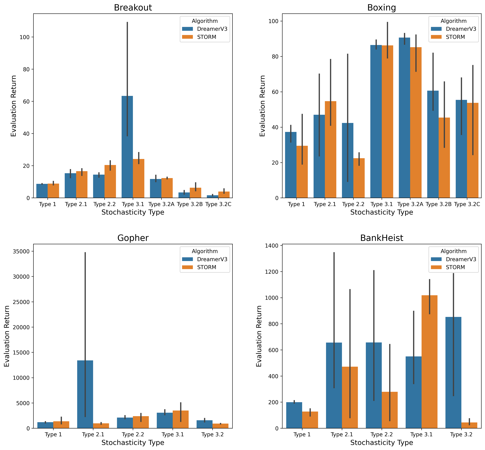

# STORI: A Benchmark and Taxonomy for Stochastic Environments

[**TL;DR**] STORI (STOchastic-ataRI) is a benchmark that incorporates diverse stochastic effects and propose a taxonomy of stochasticity in RL environments.


### STORI supports the following Atari ALE games out of the box:

- **Breakout**
- **Boxing**
- **Gopher**
- **BankHeist**


## Quick install to play any stochasticity mode using miniconda:
```
# git clone stori repository
cd stori
conda create -n stori-env python=3.10
conda activate stori-env
pip install -r requirements.txt
pip install .
```

### Play any game in interactive mode: (All modes used in [Experiments](./Exp_configs.json) are directly accessible)


```
python play_game.py
```

### For usage details refer [Getting Started](./stori/docs/getting_started.md).

## Run STORI benchmarks on DreamerV3 and STORM

STORI provides ready-to-use configuration files and scripts to run DreamerV3 and STORM agents on all supported stochasticity types and modes.

### 1. Benchmarking with DreamerV3

- **Setup:**  
  Follow the installation instructions in the [DreamerV3 README](./dreamerv3-torch/README.md).

- **Running with STORI:**  
  Use the provided [Exp_configs.json](./Exp_configs.json) to select a stochasticity profile and update [run_dreamer.sh](./dreamerv3-torch/run_dreamer.sh) file.

  Example command:
  ```
  cd dreamerv3-torch
  bash run_dreamer.sh
  ```

- **Notes:**  
  - The source implementation and default parameters for Atari100K config used from the code repository (MIT license): https://github.com/NM512/dreamerv3-torch.
  - The source implementation was modified to support STORI, gymnasium and ale_py library.

### 2. Benchmarking with STORM

- **Setup:**  
  Follow the installation instructions in the [STORM README](./STORM/readme.md).

- **Running with STORI:**  
  Use the provided [Exp_configs.json](./Exp_configs.json) to select a stochasticity profile and update [run_storm.sh](./STORM/run_storm.sh) file.

  Example command:
  ```
  cd STORM
  bash run_storm.sh
  ```

- **Notes:**  
  - The source implementation and default parameters (except eval num\_episode was set to 100) used from the code repository: https://github.com/weipu-zhang/STORM
  - The source implementation was modified to support STORI library.

### 3. Customizing Stochasticity

- All available stochasticity types and modes are described in [Modes Directory](./stori/docs/modes_directory.md).
- To define your own stochasticity profile, edit or extend the configs from `Exp_configs.json` file.

## Results and Reproducibility

All experiments in the STORI paper can be reproduced using the provided configs and scripts using seeds 0, 7 and 13.

### Experiment Stochascity Modes

#### BREAKOUT Experiments
- Type 1: Random action executed from action space instead of predicted action with a
probability of 0.3.
- Type 2.1: If a block is hit, there is probability of 0.25 that the hit is not considered and the
block is not destroyed thereby returning 0 reward and the ball bounces back.
- Type 2.2: Episode starts with default setting (Type 3.1) and after 300 steps into the episode,
the dynamics suddenly change to Type 3.2A.
- Type 3.1: Default Atari Breakout.
- Type 3.2A: The ball is only visible is a specific window between the blocks and the paddle
and permanently hidden (p = 1.0) in rest of the space between them.
- Type 3.2B: Randomly hide left vertical half of the screen 75% (p = 0.75) of the episode.
- Type 3.2C: Only a random circular area of the screen is visible every frame (p = 1.0)
similar to what someone will see when walking in a dark room with a torch.

#### BOXING Experiments
- Type 1: Random action executed from action space instead of predicted action with a
probability of 0.3.
- Type 2.1: Swaps the color of the enemy and player (character and score) with probability
of 0.001 which results in 6-7 persistent swaps per episode (2 mins boxing round).
- Type 2.2: Episode starts with default setting (Type 3.1) and after 300 steps into the episode,
the dynamics suddenly change to Type 3.2C.
- Type 3.1: Default Atari Boxing.
- Type 3.2A: Permanently hide (p = 1.0) scores and game clock.
- Type 3.2B: Randomly hide right vertical half of the screen 75% (p = 0.75) of the episode.
- Type 3.2C: Randomly hide enemy character 70% (p = 0.7) of the episode.

#### GOPHER Experiments
- Type 1: Random action executed from action space instead of predicted action with a
probability of 0.3.
- Type 2.1: Hole doesn’t fill underground below the farmer and the reward is reverted to 0
whenever farmer digs, with probability of 0.3.
- Type 2.2: At the beginning of each episode, the environment is set to the default mode
(Type 3.1). Every 600 steps, the dynamics transition cyclically between Type 3.2 and the
default.
- Type 3.1: Default Atari Gopher.
- Type 3.2: Permanently hide (p = 1.0) underground gopher movement and holes and only
hole openings are visible on surface (if any).

#### BANKHEIST Experiments
- Type 1: With probability 0.3, a random action is executed from a restricted subset of the
action space (0–9) instead of the predicted action. The restriction reduces the frequency of
fire-based actions during random sampling, preventing the agent from instantly dying by
triggering a bomb it drops on itself.
- Type 2.1: With probability 0.001, the robber is unexpectedly teleported to a different city.
- Type 2.2: At the beginning of each episode, the environment is set to the default mode
(Type 3.1). Every 600 steps, the dynamics transition cyclically between Type 3.2 and the
default.
- Type 3.1: Default Atari BankHeist.
- Type 3.2: Randomly hide city blocks 75% (p = 0.75) of the frames.

### Eval Return Results

<!--  -->

