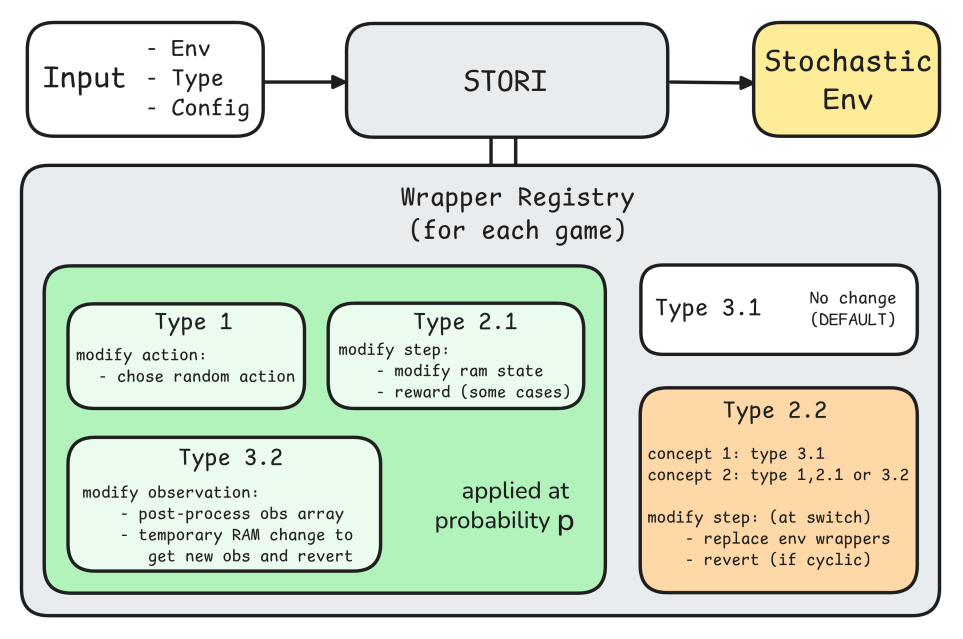

# Getting Started with STORI

Welcome to **STORI** (STOchastic-ataRI), a benchmark and taxonomy for stochastic environments in reinforcement learning. The STORI framework is built around a sophisticated wrapper-based architecture that introduces various types of uncertainty and partial observability into deterministic Atari environments with a granular control over the modifications. 

The implementation uses a hierarchical wrapper system built on top of the Atari Learning Environment (ALE). The main ‘StochasticEnv‘ class serves as the entry point, which applies different types of wrappers from ‘wrapper registry‘ of specified environment. The system supports five distinct types, each introducing different forms of stochasticity. The system is highly configurable through a dictionary-based configuration system. Users can specify probabilities for different stochasticity effects, choose between different modes of operation, and configure temporal parameters for concept drift. The wrapper registry system allows for easy extension and customization of stochasticity types for new games or research requirements.




The folloing guide will help you quickly set up and start using STORI for your experiments.
---

## 1. Installation

We recommend using [miniconda](https://docs.conda.io/en/latest/miniconda.html) for environment management.

```
# git clone stori repository
cd stori
conda create -n stori-env python=3.10
conda activate stori-env
pip install -r requirements.txt
pip install .
```

## 2. Basic example

The [Example](../.././example.py) file shows a basic example of the applying **stori** stochastic profile to an ALE environment. It also highlights
the format of stochasticity config used to create the stochasticity profile:

```
stochasticity_config = {
                        # Select stochasticity type from:
                        # 1: Intrinsic action-dependent stochastic env - Stochasticity based on agent's actions.
                        # 2.1: Intrinsic action-independent random stochastic env - Random stochasticity effects.
                        # 2.2: Intrinsic action-independent concept drift stochastic env - Concept drift over time.
                        # 3.1: Partially observed env - Different state representation. (Default ALE env is type 3.1)
                        # 3.2: Partially observed env - Missing state variables.
                        'stochasticity_type': '3.1',

                        'intrinsic_stochasticity': {

                            # Intrinsic action-dependent stochasticity parameters
                            'action_dependent': {
                                'stochastic_action_prob': 0.5 # probability of applying the modification (0.0 - 1.0)
                                },

                            # Intrinsic action-independent concept drift stochasticity parameters
                            'action_independent_concept_drift': {
                                'temporal_threshold': 300, # Steps after which the concept drifts occurs
                                'temporal_mode': 'cyclic', # Select mode from: 'cyclic', 'sudden'
                                'secondary_concept_type': '3.2', # Select secondary concept type from: '1', '2.1', '3.2'
                                },

                            # Intrinsic action-independent random stochasticity parameters
                            'action_independent_random': {
                                'mode': '3', # modes are game specific
                                'random_stochasticity_prob': 0.25, # probability of applying the modification (0.0 - 1.0)
                                }
                            },

                        # Partially observed env - Missing state variables stochasticity parameters
                        'partial_observation': {
                            'type': 'ram', # Select type from: 'ram', 'crop', 'blackout'
                            'mode': '4', # modes are game specific
                            'prob': 0.75, # probability of applying the modification (0.0 - 1.0)
                            },
                        }
```

You can read more about each stochasticity type in [Stochasticity Types](./stochasticity_types.md) file.

## 3. STORI implementation for Atari ALE games
STORI supports the following Atari ALE games out of the box:

- **Breakout**
- **Boxing**
- **Gopher**
- **BankHeist**

### Custom Wrapper Registry for Each Game

Each game provides a custom wrapper registry that maps stochasticity types to their corresponding implementation classes. This allows you to easily select and compose stochasticity wrappers for your experiments.

For example, in each game's file (e.g., [`breakout.py`](../atari_envs/breakout.py), [`boxing.py`](../atari_envs/boxing.py), [`gopher.py`](../atari_envs/gopher.py), [`bankheist.py`](../atari_envs/bankheist.py)), you will find a function like: 

```
get_{GAME NAME}_wrapper_registry()
```

All available stochasticity modes for all games can be found in [Modes Directory](./modes_directory.md).